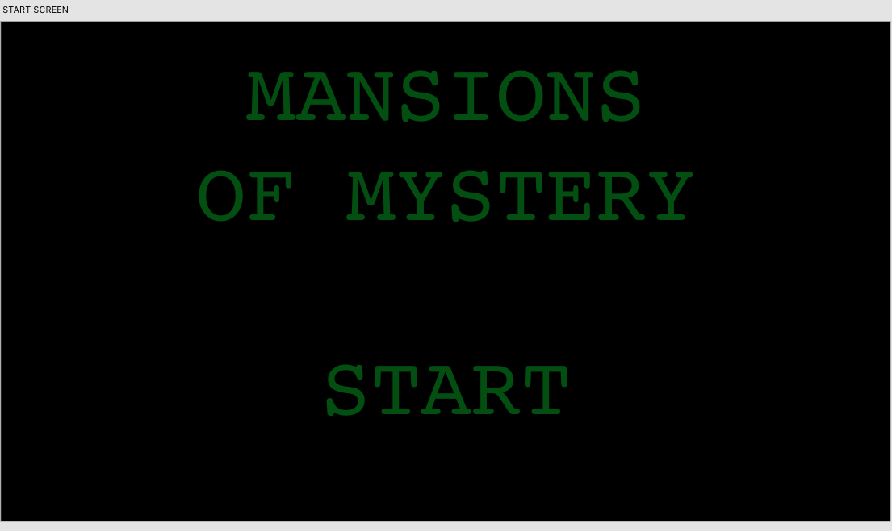
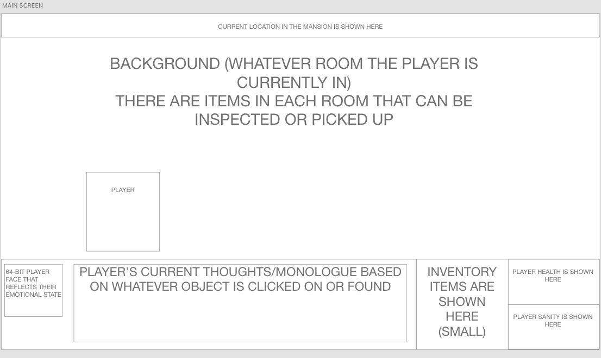
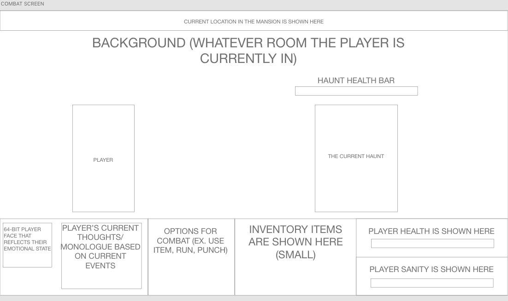

# mansion-of-mystery
Tis a backup proposal for the mod 1 project!

# Mansion of Mystery!

## Rules of the Game
In this game, you are a Trick-or-Treater on Halloween who has dared to enter the mysterious, rumored-to-be-haunted, Greywise mansion on the foggy hill on the edge of town. Soon after entering, you black out. When you awaken, you find that the giant, ornate front door is locked, as are all of the windows. As this young explorer, armed only with your bag of candy and a flashlight, you must explore Greywise mansion, looking for a key to get out. On the way, you will encounter plenty of haunts and it is up to you to use whatever you can find to survive! The player has to find a key to open the front door to escape. (This will be a point-and-click, side-scrolling adventure. The player's health and sanity will be displayed the whole time, as well as their inventory of items. The second "player" is all of the haunts trying to destroy the player/drive the player "insane"). (THIS GAME HAS 64-BIT VISUALS)

## Technical Challenges
- Getting all of the sprites to behave the way I want them to has been a challenge in the past, hopefully I can work through that this time.
- Creating options for all of the objects that can be clicked on as well as having the screen move may be hard; I may just have each background screen be a different "room" so that it doesn't have to move with the player and I can just set a different image for the background when they move.
- I could also see having a lot of different haunts leading to a lot of debugging; I'll probably just have one per room at the most so there's only one object I need to focus on at any given time.

## Wireframes 
This screen is shown as soon as the page loads (It will be much nicer looking than this I promise, and there will be a link to read the controls)
 
This is what the layout will be for each room in the mansion that the player enters.
 
When the player comes in contact with a haunt, this is the layout of the combat, wherein they have the option to fight back or run or use an item they've acquired.
 

## Timeline
<ul>
<li> Tuesday: Start pseudocoding and JS, and deciding on methods and functions for sprite actions and player choices.
 
<li> Wednesday: Work on JS, maybe start creating sprites and backgrounds for play screens.
 
<li> Thursday: More JS, flesh out items and options more, as well as starting to include haunts. 
 
<li> Friday: Keep working on and adding haunts, start really refining visuals and "UX". Test what I have so far.
 
<li> Saturday: Finish JS hopefully, work on CSS if needed.
 
<li> Sunday: Test and debug like my life depends on it.